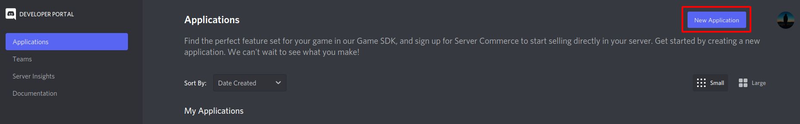
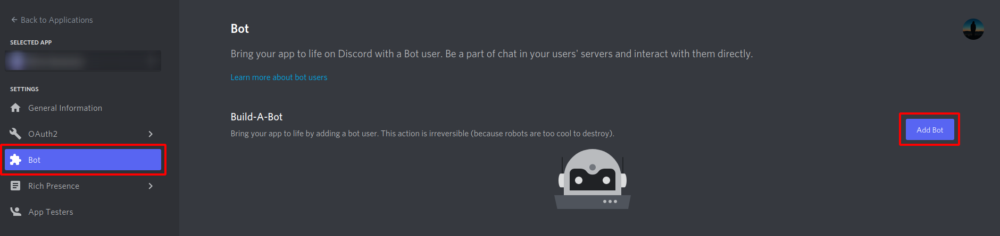
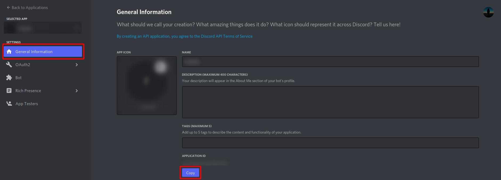
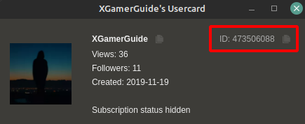
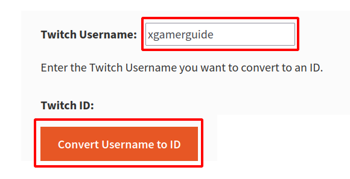

# twitch mod activity tracker

A discord bot that can show the activity of twitch moderators in a specific channel.

## Create and invite a bot

1. Go to the [discord developer portal](https://discord.com/developers/applications "discord developer portal").

2. Create a new application.

3. Create a bot.\

4. Copy your application id.\

5. Invite your bot with this link and replace `APPLICATION_ID` with your application id:\
`https://discord.com/api/oauth2/authorize?client_id=APPLICATION_ID&permissions=2147483648&scope=bot%20applications.commands`

## Get twitch token

1. It is recommended to create a new account.

2. Sign in to this account.

3. Open the developer tools:\
`Shift` + `CTRL` + `J` / `Shift` + `CTRL` + `I`

4. Open the `Storage` tab.

5. Search for `auth-token`.

6. Copy the value from `auth-token`.

7. Add `OAuth` to the start of the token:\
`OAuth YOUR_TOKEN`

## Get channel id

### Chatterino

1. Click on a chat message of the channel you want to track mod activity on.

2. Now you can copy the ID.\

### Website

1. Open a [online username converter](https://www.streamweasels.com/tools/convert-twitch-username-to-user-id/ "streamweasels.com").

2. Concert and copy the ID.\

## Setup on ubuntu

### Setup

1. `sudo apt update`
2. `sudo apt install python3 python3-pip git -y`
3. `git clone https://github.com/X-Gamer-Guide/twitch-mod-activity-tracker.git`
4. `cd twitch-mod-activity-tracker`
5. `python3 -m pip install -r requirements.txt`
6. `mkdir data`
7. `cp config_example.yml config.yml`
8. Edit `config.yml` and replace the tokens and the channel id.

### Run

`python3 main.py`

## Setup in Docker

### Setup

1. Download Docker [here](https://docs.docker.com/engine/install/ubuntu/ "Docker Ubuntu")
2. `sudo docker build -t twitch-mod-activity-tracker .`
3. `sudo docker volume create twitch_mod_activity_tracker_config`
4. `sudo docker volume create twitch_mod_activity_tracker_data`
5. `sudo docker run -v twitch_mod_activity_tracker_config:/config -v twitch_mod_activity_tracker_data:/data -d --restart unless-stopped --name twitch-mod-activity-tracker twitch-mod-activity-tracker`
6. Edit `sudo nano /var/lib/docker/volumes/twitch_mod_activity_tracker_config/_data/config.yml` and replace the tokens and the channel id.

### Remove

`sudo docker rm -f twitch-mod-activity-tracker`

### Debug

`sudo docker logs twitch-mod-activity-tracker`

## License

MIT License

Copyright © 2022 X Gamer Guide
